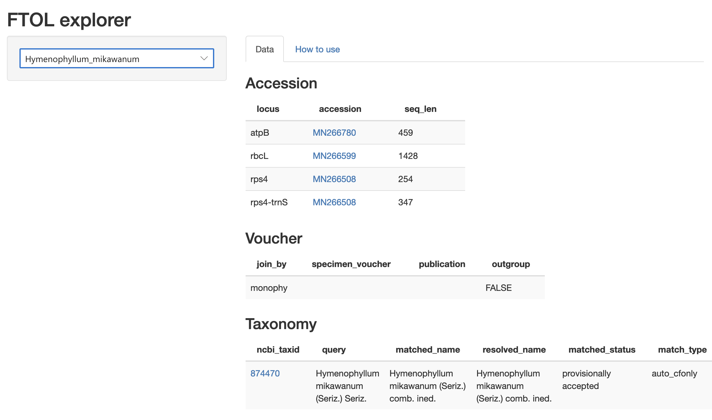

```{r setup, include=FALSE}
knitr::opts_chunk$set(echo = FALSE)
```

Please use the [FTOL data explorer](https://fernphy.shinyapps.io/ftol_explorer/) web app (https://fernphy.shinyapps.io/ftol_explorer/) to easily access more information about particular species in the tree, including GenBank accessions and taxonomy.


